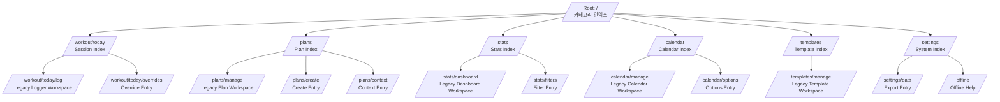

# PR5 Detail Settings Unification (iOS Settings Style)

## 적용 목표
- 상세 진입 화면을 카드 중심에서 그룹형 설정 리스트로 전환.
- 입력/고급 설정은 하위 Push 경로로 분리.
- 기존 모달 진입 경로를 Push 기반으로 재배치.

## UX 흐름도

## 모달 -> Push 전환 목록
| 기존 모달 진입 | 기존 위치 | 전환된 Push 경로 | 비고 |
| --- | --- | --- | --- |
| Create Plan BottomSheet | `/plans` | `/plans/create` | 메인 인덱스에서 모달 버튼 제거 후 Push 엔트리 제공 |
| Stats Filters BottomSheet | `/stats` | `/stats/filters` | 메인 인덱스에서 필터 진입을 Push로 분리 |
| Session Overrides BottomSheet | `/workout/today` | `/workout/today/overrides` | 메인 인덱스에서 오버라이드 진입을 Push로 분리 |
| Calendar 옵션 입력(인라인) | `/calendar` | `/calendar/options` | 캘린더 인덱스에서 옵션 입력 분리 |
| Plan 고급 컨텍스트 입력(인라인) | `/plans` | `/plans/context` | 플랜 인덱스에서 입력형 설정 분리 |

## 상세 진입 화면 표준
1. 상단: 화면 타이틀 + 짧은 설명.
2. 본문: `SectionHeader + BaseGroupedList`.
3. Row: `NavigationRow / ValueRow / InfoRow` 중심.
4. 입력/고급 제어: 하위 Push 화면으로 이관.
